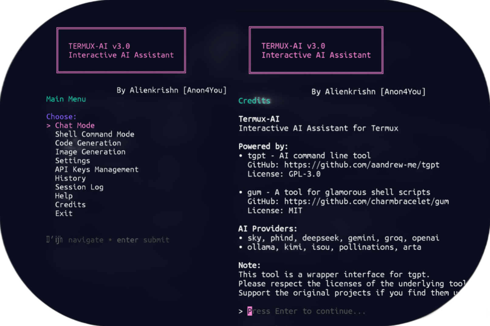

# Termux AI Assistant v3.0

> Interactive AI tool for Termux with 10+ providers and 50+ image models ✨



## ✨ Features

### 🤖 AI Modes
- **Chat**: Interactive conversations
- **Shell**: Generate terminal commands  
- **Code**: Generate programming code
- **Images**: Create art with 50+ styles

### 🔧 Management
- Secure API key storage
- Session logging
- Conversation history
- Customizable settings

## 🎯 Menu Options

1. **Chat Mode** - Talk to AI
2. **Shell Mode** - Get commands
3. **Code Mode** - Generate code
4. **Image Mode** - Create images
5. **Settings** - Configure tool
6. **API Keys** - Manage keys
7. **History** - View past chats
8. **Session Log** - Current activity
9. **Help** - Documentation
10. **Credits** - Acknowledgments
11. **Exit** - Quit application

## 💎 Version 3.0

- Complete rewrite
- tgpt integration
- gum UI interface
- 50+ image models
- Better API management

## 🚀 Installation Methods

### ⚡ Quick Install (Recommended)
```bash
curl -sL https://is.gd/Termux_Ai | bash
```

### 📦 Repository Install (Auto-updates)
```bash
pkg install termux-ai
```
*Repo:* [TermuxVoid Repo](https://termuxvoid.github.io/)

## 🏆 Provider Details

### 🆓 Free Providers
| Provider | Model | Features | Best For |
|----------|-------|----------|----------|
| **Sky** | gpt-4.1-mini | Free, Fast | General Purpose |
| **Phind** | Phind Model | Developer Focused | Coding & Tech |
| **Isou** | Web Search | Internet Access | Research |
| **Kimi** | Limited Context | Web Search | Quick Answers |
| **Pollinations** | Multiple | Image Generation | Creative Arts |

### 🎨 Image Generation
| Provider | Models | Ratios | Features |
|----------|--------|--------|----------|
| **Arta** | 50+ Styles | 9 Options | Artistic Images |
| **Pollinations** | Flux, Turbo | Custom | Quick Images |

### 🔑 API Providers
| Provider | Models | Key Required | Best For |
|----------|--------|--------------|----------|
| **OpenAI** | GPT Series | API Key | Reliability |
| **DeepSeek** | DeepSeek | API Key | Reasoning |
| **Gemini** | Gemini Pro | API Key | Creativity |
| **Groq** | Llama Models | API Key | Speed |
| **Ollama** | Local Models | Local Setup | Privacy |

## 🤝 Credits

**Powered by:**
- [tgpt](https://github.com/aandrew-me/tgpt) - AI engine
- [gum](https://github.com/charmbracelet/gum) - UI framework

**AI Providers:** sky, phind, arta, openai, gemini, deepseek, groq, ollama, kimi, isou, pollinations


*Version 3.0 | Jan 22 2025 | No root required*